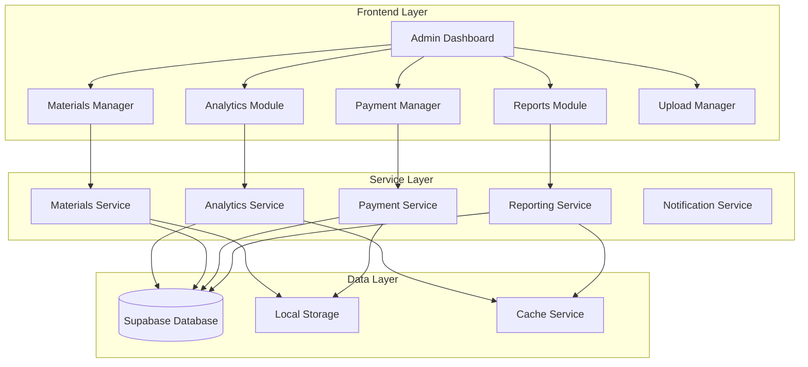

# Enhanced Admin Management System Design

## Overview

The Enhanced Admin Management System builds upon the existing FarmTech admin infrastructure to provide comprehensive analytics, materials management, payment processing, and reporting capabilities. The system leverages the current React/Supabase architecture while introducing new components and services to meet the enhanced admin requirements.

## Architecture

### System Architecture Diagram



### Technology Stack

- **Frontend**: React 18, React Router, Tailwind CSS, Lucide React Icons
- **Backend**: Supabase (PostgreSQL, Auth, Real-time subscriptions)
- **State Management**: React Context API, Local Storage
- **Charts/Analytics**: Chart.js or Recharts for data visualization
- **File Handling**: Supabase Storage for file uploads
- **Notifications**: React Hot Toast, Email notifications via Supabase Edge Functions

## Components and Interfaces

### 1. Enhanced Admin Dashboard

**Location**: `src/pages/AdminDashboard.jsx` (enhancement)

**Key Features**:
- Comprehensive analytics overview with interactive charts
- Quick action buttons for common admin tasks
- Real-time statistics updates
- Responsive design for mobile and desktop

**Props Interface**:
```javascript
interface AdminDashboardProps {
  userProfile: UserProfile;
  isAdmin: () => boolean;
}
```

### 2. Analytics Dashboard Component

**Location**: `src/components/admin/AnalyticsDashboard.jsx` (new)

**Key Features**:
- User growth metrics with time-series charts
- Revenue and order analytics
- Material popularity and inventory insights
- Upload activity and approval rates
- Customizable date range filtering

**Props Interface**:
```javascript
interface AnalyticsDashboardProps {
  dateRange: { start: Date; end: Date };
  onDateRangeChange: (range) => void;
}
```

### 3. Enhanced Materials Manager

**Location**: `src/components/admin/AdminMaterialsManager.jsx` (enhancement)

**Key Features**:
- CRUD operations for materials with form validation
- Bulk operations (import/export, bulk price updates)
- Stock level monitoring with low-stock alerts
- Category and subcategory management
- Image upload and management
- Price history tracking

**Props Interface**:
```javascript
interface MaterialsManagerProps {
  onMaterialUpdate: (material) => void;
  onStockAlert: (materials) => void;
}
```

### 4. Payment Review System

**Location**: `src/components/admin/PaymentReviewSystem.jsx` (new)

**Key Features**:
- Payment submission queue with filtering and sorting
- Image viewer for payment screenshots
- Bulk approval/rejection actions
- Payment history and audit trail
- Automated notification system

**Props Interface**:
```javascript
interface PaymentReviewSystemProps {
  onPaymentAction: (paymentId, action, notes) => void;
  onBulkAction: (paymentIds, action) => void;
}
```

### 5. Enhanced Upload Manager

**Location**: `src/components/admin/UploadManager.jsx` (enhancement)

**Key Features**:
- Advanced filtering (by crop type, status, date range)
- Bulk review actions
- Image preview and annotation tools
- Upload analytics and insights
- Automated categorization suggestions

### 6. Reporting Engine

**Location**: `src/components/admin/ReportsEngine.jsx` (new)

**Key Features**:
- Pre-built report templates
- Custom report builder with drag-and-drop interface
- Export functionality (PDF, CSV, Excel)
- Scheduled report generation
- Email delivery system

**Props Interface**:
```javascript
interface ReportsEngineProps {
  reportTypes: ReportType[];
  onReportGenerate: (config) => void;
  onReportSchedule: (config) => void;
}
```

## Data Models

### 1. Enhanced Material Model

**Location**: `src/models/Material.js` (enhancement)

**Additional Fields**:
```javascript
{
  // Existing fields...
  priceHistory: [
    {
      price: number,
      effectiveDate: Date,
      updatedBy: string,
      reason: string
    }
  ],
  lowStockThreshold: number,
  reorderLevel: number,
  supplier: {
    name: string,
    contact: string,
    email: string
  },
  tags: string[],
  isActive: boolean,
  seoMetadata: {
    title: string,
    description: string,
    keywords: string[]
  }
}
```

### 2. Payment Submission Model

**Location**: `src/models/PaymentSubmission.js` (new)

```javascript
class PaymentSubmission {
  constructor(data = {}) {
    this.id = data.id || this.generateId();
    this.orderId = data.orderId;
    this.farmerId = data.farmerId;
    this.farmerName = data.farmerName;
    this.phoneNumber = data.phoneNumber;
    this.transactionId = data.transactionId;
    this.paymentMethod = data.paymentMethod; // 'upi', 'bank_transfer', 'cash'
    this.amount = data.amount;
    this.screenshotUrl = data.screenshotUrl;
    this.status = data.status || 'pending'; // 'pending', 'approved', 'rejected'
    this.submittedAt = data.submittedAt || new Date();
    this.reviewedAt = data.reviewedAt;
    this.reviewedBy = data.reviewedBy;
    this.adminNotes = data.adminNotes || '';
    this.rejectionReason = data.rejectionReason || '';
  }
}
```

### 3. Analytics Data Model

**Location**: `src/models/Analytics.js` (new)

```javascript
class AnalyticsData {
  constructor(data = {}) {
    this.id = data.id || this.generateId();
    this.metricType = data.metricType; // 'user_growth', 'revenue', 'orders', 'uploads'
    this.value = data.value;
    this.date = data.date || new Date();
    this.metadata = data.metadata || {};
    this.aggregationType = data.aggregationType; // 'daily', 'weekly', 'monthly'
  }
}
```

### 4. Report Configuration Model

**Location**: `src/models/ReportConfig.js` (new)

```javascript
class ReportConfig {
  constructor(data = {}) {
    this.id = data.id || this.generateId();
    this.name = data.name;
    this.type = data.type; // 'user_activity', 'financial', 'inventory', 'custom'
    this.parameters = data.parameters || {};
    this.schedule = data.schedule; // cron expression for scheduled reports
    this.format = data.format || 'pdf'; // 'pdf', 'csv', 'excel'
    this.recipients = data.recipients || [];
    this.isActive = data.isActive !== undefined ? data.isActive : true;
    this.createdBy = data.createdBy;
    this.createdAt = data.createdAt || new Date();
  }
}
```

## Services Architecture

### 1. Analytics Service

**Location**: `src/services/analyticsService.js` (new)

**Key Methods**:
```javascript
class AnalyticsService {
  async getUserGrowthMetrics(dateRange);
  async getRevenueMetrics(dateRange);
  async getOrderMetrics(dateRange);
  async getUploadMetrics(dateRange);
  async getMaterialPopularity(dateRange);
  async generateDashboardSummary();
  async trackEvent(eventType, metadata);
}
```

### 2. Enhanced Materials Service

**Location**: `src/services/materialsService.js` (new)

**Key Methods**:
```javascript
class MaterialsService {
  async createMaterial(materialData);
  async updateMaterial(id, updateData);
  async deleteMaterial(id);
  async updateStock(id, quantity, operation);
  async getLowStockItems();
  async updatePricing(id, newPrice, reason);
  async bulkUpdatePrices(updates);
  async exportMaterials(format);
  async importMaterials(data);
}
```

### 3. Payment Service

**Location**: `src/services/paymentService.js` (new)

**Key Methods**:
```javascript
class PaymentService {
  async submitPayment(paymentData);
  async reviewPayment(paymentId, action, notes);
  async bulkReviewPayments(paymentIds, action);
  async getPaymentHistory(filters);
  async generatePaymentReport(dateRange);
  async sendPaymentNotification(paymentId, type);
}
```

### 4. Reporting Service

**Location**: `src/services/reportingService.js` (new)

**Key Methods**:
```javascript
class ReportingService {
  async generateReport(config);
  async scheduleReport(config);
  async getReportHistory();
  async exportReport(reportId, format);
  async emailReport(reportId, recipients);
  async getReportTemplates();
}
```

### 5. Notification Service

**Location**: `src/services/notificationService.js` (new)

**Key Methods**:
```javascript
class NotificationService {
  async sendEmailNotification(to, template, data);
  async sendSMSNotification(phone, message);
  async createInAppNotification(userId, message);
  async getNotificationHistory(userId);
  async markAsRead(notificationId);
}
```

## Database Schema Extensions

### 1. Analytics Tables

```sql
-- Analytics metrics table
CREATE TABLE analytics_metrics (
  id UUID PRIMARY KEY DEFAULT gen_random_uuid(),
  metric_type VARCHAR(50) NOT NULL,
  value DECIMAL(15,2) NOT NULL,
  date DATE NOT NULL,
  metadata JSONB DEFAULT '{}',
  aggregation_type VARCHAR(20) DEFAULT 'daily',
  created_at TIMESTAMP WITH TIME ZONE DEFAULT NOW()
);

-- Indexes for performance
CREATE INDEX idx_analytics_metrics_type_date ON analytics_metrics(metric_type, date);
CREATE INDEX idx_analytics_metrics_date ON analytics_metrics(date);
```

### 2. Enhanced Materials Tables

```sql
-- Add columns to existing materials table
ALTER TABLE materials ADD COLUMN IF NOT EXISTS price_history JSONB DEFAULT '[]';
ALTER TABLE materials ADD COLUMN IF NOT EXISTS low_stock_threshold INTEGER DEFAULT 10;
ALTER TABLE materials ADD COLUMN IF NOT EXISTS reorder_level INTEGER DEFAULT 20;
ALTER TABLE materials ADD COLUMN IF NOT EXISTS supplier JSONB DEFAULT '{}';
ALTER TABLE materials ADD COLUMN IF NOT EXISTS tags TEXT[] DEFAULT '{}';
ALTER TABLE materials ADD COLUMN IF NOT EXISTS is_active BOOLEAN DEFAULT true;
ALTER TABLE materials ADD COLUMN IF NOT EXISTS seo_metadata JSONB DEFAULT '{}';
```

### 3. Payment Submissions Table

```sql
CREATE TABLE payment_submissions (
  id UUID PRIMARY KEY DEFAULT gen_random_uuid(),
  order_id UUID REFERENCES orders(id),
  farmer_id UUID REFERENCES profiles(id),
  farmer_name VARCHAR(255) NOT NULL,
  phone_number VARCHAR(20),
  transaction_id VARCHAR(100) NOT NULL,
  payment_method VARCHAR(50) DEFAULT 'upi',
  amount DECIMAL(10,2) NOT NULL,
  screenshot_url TEXT,
  status VARCHAR(20) DEFAULT 'pending',
  submitted_at TIMESTAMP WITH TIME ZONE DEFAULT NOW(),
  reviewed_at TIMESTAMP WITH TIME ZONE,
  reviewed_by UUID REFERENCES profiles(id),
  admin_notes TEXT,
  rejection_reason TEXT,
  created_at TIMESTAMP WITH TIME ZONE DEFAULT NOW(),
  updated_at TIMESTAMP WITH TIME ZONE DEFAULT NOW()
);

-- Indexes
CREATE INDEX idx_payment_submissions_status ON payment_submissions(status);
CREATE INDEX idx_payment_submissions_farmer ON payment_submissions(farmer_id);
CREATE INDEX idx_payment_submissions_date ON payment_submissions(submitted_at);
```

### 4. Report Configurations Table

```sql
CREATE TABLE report_configurations (
  id UUID PRIMARY KEY DEFAULT gen_random_uuid(),
  name VARCHAR(255) NOT NULL,
  type VARCHAR(50) NOT NULL,
  parameters JSONB DEFAULT '{}',
  schedule VARCHAR(100), -- cron expression
  format VARCHAR(20) DEFAULT 'pdf',
  recipients TEXT[] DEFAULT '{}',
  is_active BOOLEAN DEFAULT true,
  created_by UUID REFERENCES profiles(id),
  created_at TIMESTAMP WITH TIME ZONE DEFAULT NOW(),
  updated_at TIMESTAMP WITH TIME ZONE DEFAULT NOW()
);
```

## Error Handling

### 1. Service Layer Error Handling

```javascript
class AdminServiceError extends Error {
  constructor(message, code, details = {}) {
    super(message);
    this.name = 'AdminServiceError';
    this.code = code;
    this.details = details;
  }
}

// Error codes
const ERROR_CODES = {
  VALIDATION_FAILED: 'VALIDATION_FAILED',
  INSUFFICIENT_PERMISSIONS: 'INSUFFICIENT_PERMISSIONS',
  RESOURCE_NOT_FOUND: 'RESOURCE_NOT_FOUND',
  OPERATION_FAILED: 'OPERATION_FAILED',
  EXTERNAL_SERVICE_ERROR: 'EXTERNAL_SERVICE_ERROR'
};
```

### 2. Component Error Boundaries

```javascript
class AdminErrorBoundary extends React.Component {
  constructor(props) {
    super(props);
    this.state = { hasError: false, error: null };
  }

  static getDerivedStateFromError(error) {
    return { hasError: true, error };
  }

  componentDidCatch(error, errorInfo) {
    console.error('Admin component error:', error, errorInfo);
    // Log to monitoring service
  }

  render() {
    if (this.state.hasError) {
      return <AdminErrorFallback error={this.state.error} />;
    }
    return this.props.children;
  }
}
```

## Testing Strategy

### 1. Unit Testing

- **Components**: Test all admin components with React Testing Library
- **Services**: Test all service methods with mock data
- **Models**: Test data validation and transformation methods
- **Utilities**: Test helper functions and calculations

### 2. Integration Testing

- **API Integration**: Test Supabase integration with test database
- **Component Integration**: Test component interactions and data flow
- **Service Integration**: Test service layer interactions

### 3. End-to-End Testing

- **Admin Workflows**: Test complete admin user journeys
- **Payment Processing**: Test payment review and approval workflows
- **Report Generation**: Test report creation and export functionality

### 4. Performance Testing

- **Dashboard Loading**: Test dashboard performance with large datasets
- **Report Generation**: Test report generation performance
- **Real-time Updates**: Test real-time subscription performance

## Security Considerations

### 1. Authentication and Authorization

- **Role-based Access Control**: Ensure only admin users can access admin features
- **Permission Granularity**: Implement fine-grained permissions for different admin actions
- **Session Management**: Secure session handling with automatic timeout

### 2. Data Protection

- **Input Validation**: Validate all user inputs on both client and server side
- **SQL Injection Prevention**: Use parameterized queries and Supabase RLS
- **File Upload Security**: Validate file types and scan for malicious content

### 3. API Security

- **Rate Limiting**: Implement rate limiting for admin API endpoints
- **Audit Logging**: Log all admin actions for security auditing
- **Data Encryption**: Encrypt sensitive data in transit and at rest

## Performance Optimization

### 1. Frontend Optimization

- **Code Splitting**: Lazy load admin components to reduce initial bundle size
- **Memoization**: Use React.memo and useMemo for expensive calculations
- **Virtual Scrolling**: Implement virtual scrolling for large data lists

### 2. Backend Optimization

- **Database Indexing**: Create appropriate indexes for query performance
- **Caching Strategy**: Implement Redis caching for frequently accessed data
- **Query Optimization**: Optimize Supabase queries with proper joins and filters

### 3. Real-time Updates

- **Selective Subscriptions**: Subscribe only to relevant data changes
- **Debouncing**: Debounce rapid updates to prevent UI thrashing
- **Connection Management**: Manage WebSocket connections efficiently

## Deployment and Monitoring

### 1. Deployment Strategy

- **Environment Configuration**: Separate configurations for development, staging, and production
- **Feature Flags**: Use feature flags for gradual rollout of new admin features
- **Database Migrations**: Implement safe database migration procedures

### 2. Monitoring and Logging

- **Application Monitoring**: Monitor admin application performance and errors
- **User Activity Tracking**: Track admin user actions for analytics and auditing
- **System Health Monitoring**: Monitor system resources and database performance

### 3. Backup and Recovery

- **Data Backup**: Regular automated backups of admin data
- **Disaster Recovery**: Documented procedures for system recovery
- **Data Retention**: Implement data retention policies for compliance